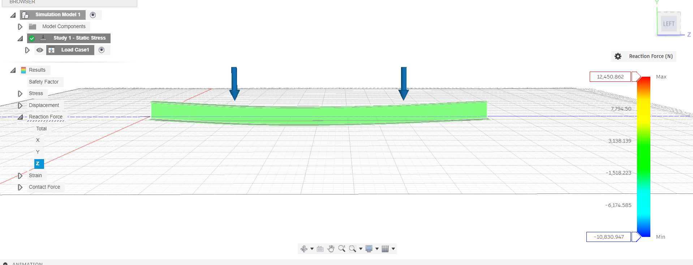

# Simulation Study Report: Static Stress Analysis

This repository contains a detailed report of a static stress simulation performed using Autodesk Fusion.

## About the Study

This study analyzes the structural integrity of a 3D model under specific load conditions. The goal was to determine the safety factor, stress, and displacement to ensure the design's reliability.

* **Study Type**: Static Stress
* **Material**: Stainless Steel
* **Software**: Autodesk Fusion (2604.0.316)

## Preview

Here is a preview of the stress analysis results:



## How to View the Full Report

The full interactive report is available as an HTML file.

1.  **Download** the `Studies_Report_2025-09-13.html` file from this repository.
2.  **Open it** in any web browser (like Chrome, Firefox, or Safari) to view the complete analysis.


    ```markdown
    
    ```

## License

This project is licensed under the MIT License. See the [LICENSE](LICENSE) file for details.
